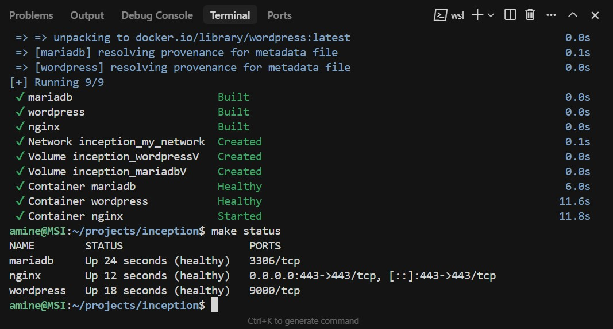

# Inception Project

This project sets up a simple web server environment using Docker and Docker Compose. It includes Nginx, MariaDB, and WordPress, each running in its own container.

## Screenshots
<p align="center">
    
    
    
</p>

## Quick Start

1. **Clone the repository**
   ```bash
   git clone <your-repo-url>
   cd inception
   ```

2. **Create a `.env` file** in the project root with your settings. Example:
   ```env
   DOMAIN_NAME=yourdomain.com
   DB_NAME=wordpress
   DB_USER=wpuser
   DB_PASS=yourpassword
   ROOT_PASS=adminpassword
   EMAIL_ROOT=admin@example.com
   EMAIL=editor@example.com
   URL=https://yourdomain.com
   TITLE=MyWordPressSite
   ```

3. **Start everything with one command:**
   ```bash
   make up
   ```
   This will automatically create the needed data directories and build/start all containers.


4. **Access your site:**
   
   The project is configured to work with **both** the domain specified in your `.env` file **and** `localhost` for easier testing. You can access your site using either:
   
   - **Option 1: Using localhost (Recommended for quick testing)**
     ```
     https://localhost
     ```
     This works immediately without any additional configuration - perfect for testing after cloning the repository!
   
   - **Option 2: Using your configured domain**
     ```
     https://yourdomain.com  (or whatever you set in DOMAIN_NAME)
     ```
     To use this option, you'll need to add your domain to your hosts file:
     - **Linux/macOS**: Add `127.0.0.1 yourdomain.com` to `/etc/hosts`
     - **Windows**: Add `127.0.0.1 yourdomain.com` to `C:\Windows\System32\drivers\etc\hosts` (requires admin privileges)
     - **WSL**: Add `127.0.0.1 yourdomain.com` to `/etc/hosts` in your WSL distribution
   
   > **Why both options?** The project includes dynamic URL detection that automatically adapts WordPress URLs based on how you access the site. This allows anyone who clones the repository to test immediately using `localhost` without needing to modify system hosts files, while still supporting the configured domain for production-like testing.

## Stopping and Cleaning Up

- To stop the containers:
  ```bash
  make down
  ```
- To remove all containers, images, and data:
  ```bash
  make fclean
  ```

## Notes
- The Nginx server uses a self-signed SSL certificate. Your browser may show a warning - this is normal for local development.
- Data is stored in your home directory under `~/data/wordpress` and `~/data/mariadb`.
- You can change settings by editing the `.env` file and running `make re`.
- **Dynamic URL Support**: The project automatically detects whether you're accessing via `localhost` or your configured domain and generates WordPress URLs accordingly. This means CSS, JavaScript, and other assets will load correctly regardless of which URL you use.

## Project Files
- `docker-compose.yml`: Defines the services and how they connect.
- `requirements/`: Contains Dockerfiles and configuration for each service.
- `Makefile`: Automates all setup and management commands.

## Troubleshooting
- Make sure Docker and Docker Compose are installed and running.
- Check the logs with `docker compose logs` if something does not work.
- Ensure your `.env` file is correct and all needed variables are set.

---

This project is for educational purposes and is a good starting point for learning about Docker, Nginx, MariaDB, and WordPress integration.
